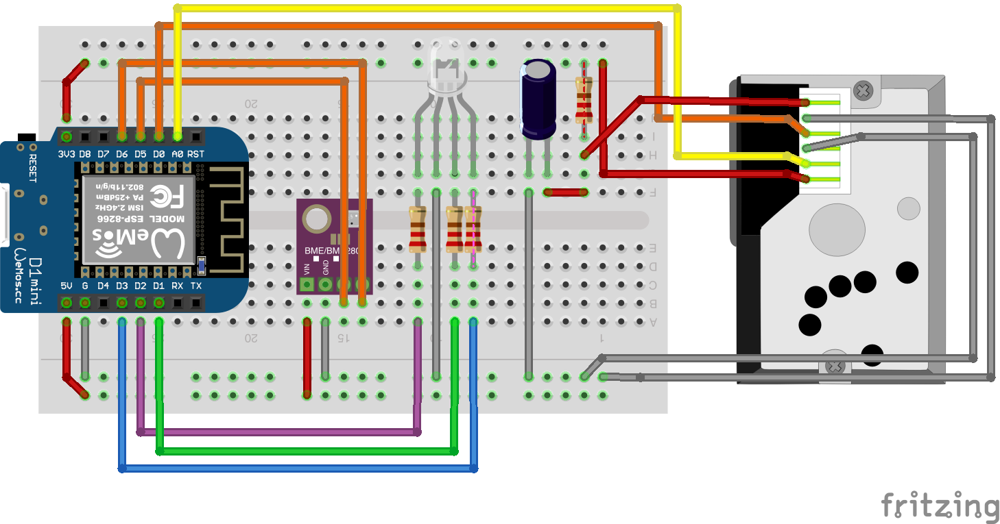

# Skunk!

Skunk is a small air quality meter aimed at developing countries, home projects and in every place where affordable air quality meter might be necessary. 

It is designed to be cheap and easy to make from over-the-counter parts.

## Capabilities

Skunk can measure following air parameters:

* PM 2,5
* Temperature
* Humidity
* Pressure

Results are available as a website presented when user connects to a WiFi network the device is broadcasting. It is also possible to configure skunk to connect to any available 2.4 GHz WiFi network and view its results there.

## Hardware

* [WeMOS D1 mini](https://www.wemos.cc/en/latest/d1/d1_mini.html) - for CPU / Memory / IO and WiFi capabilities
* [GP2Y1010AU0F](https://www.sharpsde.com/products/optoelectronic-components/model/GP2Y1010AU0F/) - dust sensor from Sharp
* [BME280](https://www.bosch-sensortec.com/products/environmental-sensors/humidity-sensors-bme280/) - temprerature, humidity and air pressure sensor from BOSH

Data sheets for used components are available in [datasheets](/datasheets) directory.

## Software

Project is developed in [MicroPython](https://micropython.org). All sources are available in [src](/src) directory. All binaries are stored in [bin](/bin) directory. 

## Designs

So far, only breadboard designed is finished, with parts on their way to complete the prototype. 

All hardware designs are stored in [board](/board) directory.

## HowTos

All of HowTo's are saved in [docs](/docs) directory.
